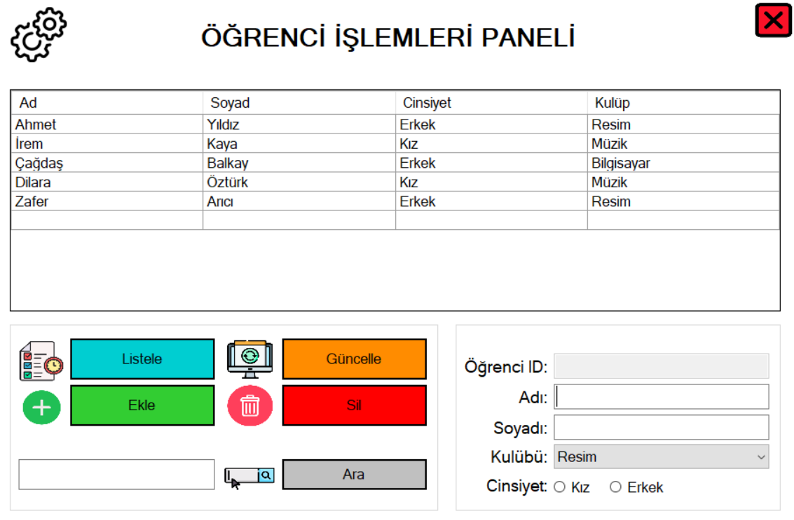

# OKUL YÖNETİM SİSTEMİ PROJESİ
## Özet
Bu sistem ile bir öğretmen öğrencilerinin ders, kulüp ve not bilgilerini yönetebilir.

## Sistemin Çalışması

### Giriş Paneli

Giriş ekranında bizi Öğrenci Girişi, Öğretmen Girişi ve Çıkış olmak üzere 3 bölüm karşılıyor. 

### Öğrenci Girişi Paneli

Bu ekranda öğrenci numarası ile sisteme giriş yapılabilir.

## Öğretmen Paneli

Öğretmen panelinde bizi Ders İşlemleri, Kulüp İşlemleri, Sınav Notları ve Öğrenci İşlemleri olmak üzere 4 ayrı bölüm karşılamaktadır.

## Ders İşlemleri Paneli

Bu panel üzerinden mevcut dersler listelenebilir, ders ekleme, silme ve güncelleme işlemleri gerçekleştirilebilir..

## Kulüp İşlemleri Paneli

Bu panel üzerinden mevcut kulüpler listelenebilir, kulüp ekleme, silme, güncelleme işlemleri gerçekleştirilebilir. 

## Sınav Notları Paneli

Bu panelde öğrenci id numarasına göre sınav notları taranabilir, öğrencinin notları hesaplayıp güncellenebilir. 

## Öğrenci İşlemleri Paneli

Bu panelde isme göre öğrenci aranabilir ve öğrenci ekleme, silme, güncelleme işlemleri gerçekleştirilebilir. 

